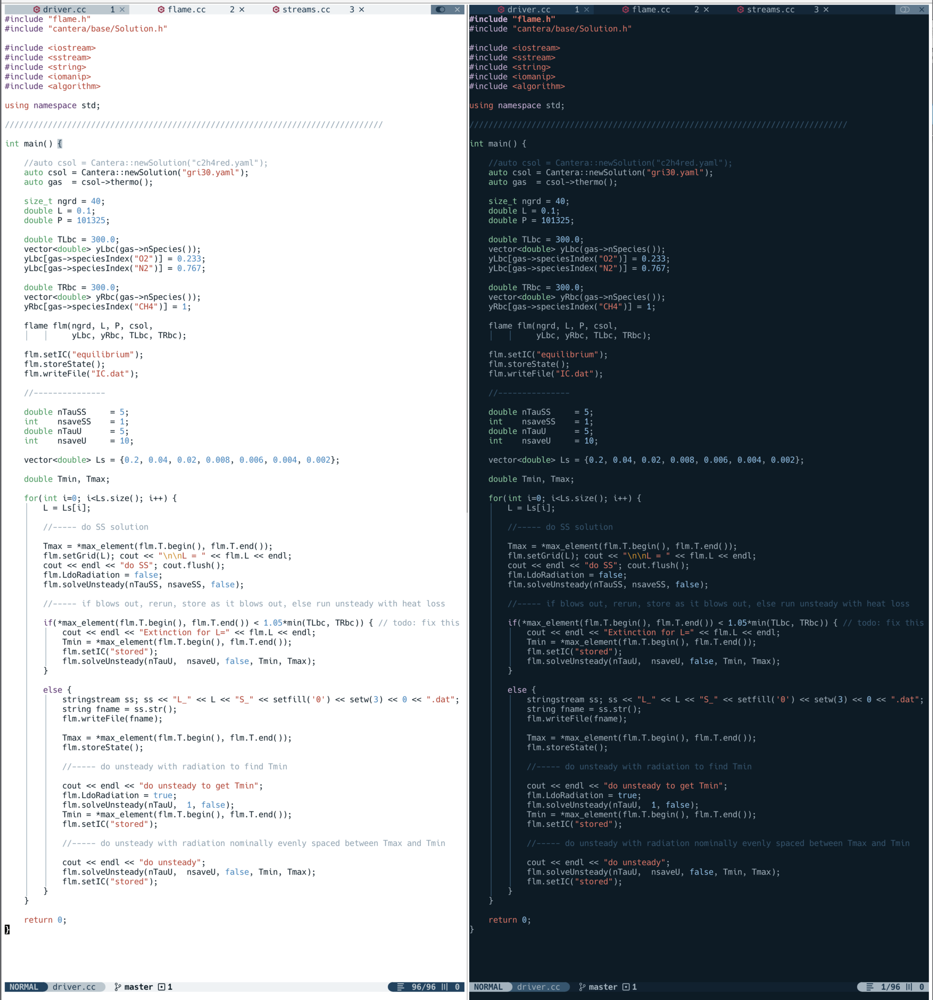

# NVChad customizations

Customizations of NVChad v2.5

## Installation

* Install [NvChad](https://nvchad.com)
* Replace contents of ~/.config/nvim with the contents of this repository

## Added features and changes
* Plugins
    * markdown preview
    * LaTeX
    * Tmux navigation
    * maximize windows
    * open/close terminal
* User defined snippets
* Autocommands for text files (wrapping)
* Two new themes: forsake (dark), and repent (light)
* Customized statusline and tabline
    * turn on buffer numbers
* Mappings

